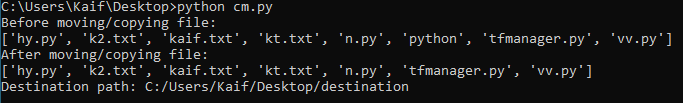
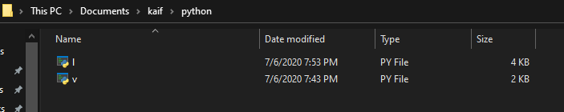
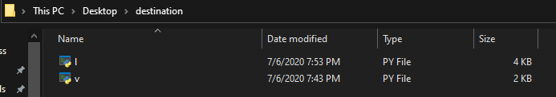

# CLI-Copy-Paste

In this project we will going to copy or cut files/folders inside a CLI with Python.

# How To Run

- To perform your desire task(copy/move) just give this command in cmd:-
   
                       python cm.py

 

- By default the code is set to perform move.
- But if you want to perform copy then just remove '#' from line no. 28 and comment the line no. 24.
- If you want to copy a single file then just remove '#' from line no. 32 and comment the line no. 24.
# Before

# After

# Limitations

- You must always provide the source and destination path for copy or move in the code.
- You must always remove/add '#' for your desire output.

So, thats all for now.
I hope you will admire this.

